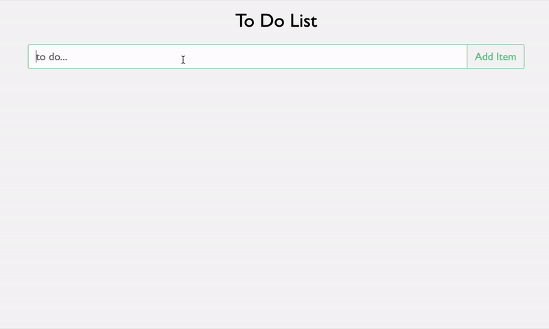

# React ToDo

This is a todo app built using React, .NET, SQL Server, and Docker. It features stateful and persistent editing, completing, and deleting of todos.

## Goals:
- Create a responsive ToDo app using React. The Recoil [basic tutorial](https://recoiljs.org/docs/basic-tutorial/intro) served as a base for state management.
- Utilize Flexbox and CSS animations.
- Utilize ASP.NET, Entity Framework, and SQL Server for a persistent backend

## Getting Started
Prerequisites: [Docker](https://www.docker.com/)

1. Clone the repository
2. `$ cd docker/dev`
3. `$ docker compose up`

## Techincal stack
- Sass  
- React (Recoil)  
- TypeScript  
- ASP.NET (Entity Framework)  
- SQL Server (using Entity Framework)  
- Docker  

## Improvment Opportunties
- Offline Editing
- Integration Testing
