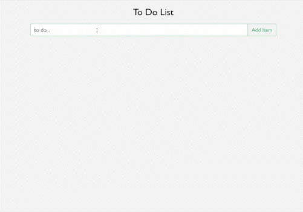

# React ToDo

This app is the result of me learning how to use React, .NET, and SQL Server, and Docker. I'm using Recoil and TypeScript in conjunction with React for a frontend. The backend consists of a .NET API and a SQL Server database managed through entity framework. The entire app is dockerized. 

## Goals:
- Create a responsive ToDo app with state using React. The Recoil [basic tutorial](https://recoiljs.org/docs/basic-tutorial/intro) served as a base for learning how to use a state library. 
- Learn how to use Flexbox and CSS animations.
- Learn how to use ASP.NET, entity framework, and SQL Server

## Getting Started
Prerequisites: node.js installed

1. `npm install`  
2. `npm run start`
3. navigate to the url returned by the parcel server (`http://localhost:1234/` by default)

## Techincal stack
Docker  
ASP.NET  
SQL Server (using Entity Framework)  
node.js  
TypeScript
React  
Recoil (state management)  
Sass

## Preview

